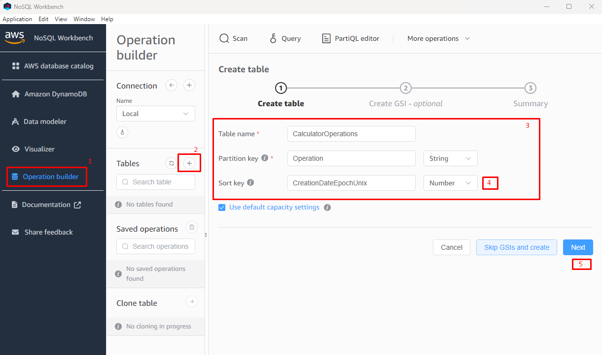
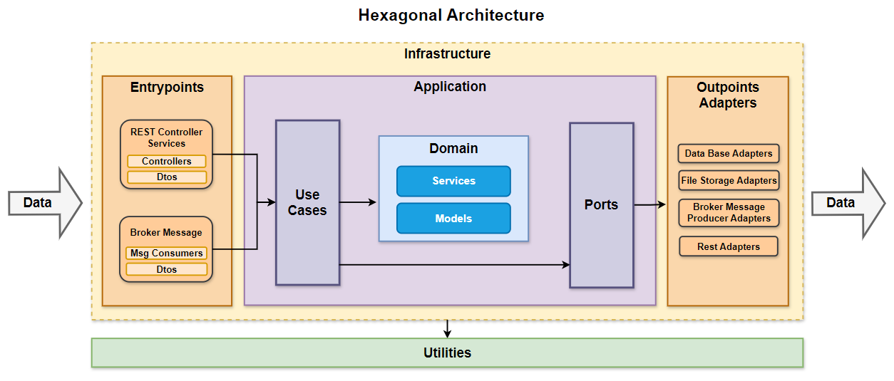

# [El nombre de tu proyecto va aquí]


***
**Tabla de Contenido**
1. [Introducción](#id1)
2. [Levantando la Aplicación](#id2)
    * 2.1. [Pre-Requisitos](#id2.1)
    * 2.2. [Ejecutando la Aplicación](#id2.2)
    * 2.3. [Variables de Entorno](#id2.3)    
3. [Probando los servicios](#id3)
4. [Arquitectura de Aplicaciones](#id4)
    * 4.1. [Arquitectura Hexagonal](#id4.1)

***
Este proyecto se basa en la [**Arquitectura Hexagonal**](#id4) descrita en la sección 4 de este documento. El objetivo de este proyecto es usarlo como base para el desarrollo de las aplicaciones de FDLM que requieran una Arquitectura Hexagonal, una vez clonado, 
debes incluir tus propias clases en los módulos pre-configurados del proyecto. También debes eliminar y adicionar los **Módulos** que requiera tu proyecto.

La distribución de módulos y paquetes del proyecto se basa en una Arquitectura Hexagonal e incluye ejemplos de servicios Rest.


<div id='id1' />

## 1. Introducción

[Se debe reemplazar esta introducción por una pequeña descripción de lo que hace el microservicio en general desde el punto de vista de negocio]

Este microservicio permite presentar en funcionamiento la Arquietectura de Referencia de Aplicaciones y su objetivo es que sirva como guía en la construcción de microservicios, mostrar ejemplos de implementación de buenas prácticas de desarrollo y agilizar el desarrollo de microservicios.

Esta aplicación de ejemplo expone 3 servicios Rest que permiten:
* Sumar números enteros o complejos.
* Consultar las operaciones realizadas en un rango de fechas.
* Consultar una operación por ID.

La aplicación es capaz de persistir las operaciones en una base de datos embebida LiteDB o en DynamoDB y se usó Swagger para la documentación de los servicios, para conocer como consumirlos se puede levantar la aplicación y acceder a la URL: [http://localhost:5000/swagger/index.html](http://localhost:5000/swagger/index.html).

Adicionalmente la aplicación tiene ejemplos sobre:
* Como usar Memory Cache para optimizar consultas a bases de datos.
* Como usar Polly para implementar Circuit Breaker en los llamados a servicios externos.
* Ejemplo de contenerización en Docker.
* Ejemplos de pruebas unitarias y de integración.
* Inyección de dependencias usando sustitución de liskov.
* Manejo de archivos de configuración según el ambiente de despliegue.
* Manejo de Conceptos de Abierto y Cerrado.

La aplicación implementa la [**Arquitectura Hexagonal**](#id4) descrita en la sección 4 de este documento usando una sola solución dividida en 5 proyectos independientes más 2 proyectos de soporte que no son parte de la arquitectura pero se necesitan para su ejecución (FDLM.Runner y FDLM.Test). 

En la solución, cada proyecto representa una capa de la arquitectura permitiendo separar y encapsular debidamente las responsabilidades de cada capa. Se recomienda revisar las dependencias entre los proyectos para evidenciar como las dependencias mapean la Arquitectura y la forma en la que se comunican las capas.

Al ser un proyecto de ejemplo que se usará como base para otro proyecto, se debe tener en cuenta lo siguiente:
* Clonar este repositorio y copiar el código en el nuevo repositorio.
* Cambiar el nombre a la solución por la de tu microservicio.
* Buscar y Reemplzar todas las coincidencias de "ms-my-microservice" por el nombre del microservicio a construir.
* Personalizar la configuración de Swagger del proyecto desde los archivos: 
  * /src/FDLM.Runner/Program.cs
  * /src/FDLM.Infrastructure.EntrypointsAdapters/Injections/SwaggerInjection.cs
* Personalizar los scripts de despliegue desde los archivos:
  * /Dockerfile
  * /src/FDLM.Runner/.gitlab-ci.yml
  * /src/FDLM.Runner/cd-ci-aws
* Modificar este Readme y adaptarlo a tu proyecto.

<div id='id2' />

## 2. Levantando la Aplicación

La aplicación permite ser ejecutada de forma local usando bases de datos locales, es posible usar dos tipos de bases de datos: una **LiteDB** que es usada para la ejecución de **Pruebas de Integración** y verificar funcionalidades de forma local, y también es posible configurar una base de datos **DynamoDB Local**, que permite verificar funcionalidades (no usar para pruebas de integración).

Para configurar una u otra base de datos se debe cambiar el valor del campo "Database:Active" del archivo: **/src/FDLM.Runner/appsettings.local.json**, los posibles valores son: LiteDB o DynamoDB. Esto solo aplica para el ambiente **"local"**.

La aplicación permite tener diferentes configuraciones según el ambiente en el que se ejecute, los ambientes soportados son: 
* **local**: Usado para la construcción de la aplicación e ideal para verificar funcionalidades de forma local, en este ambiente se usan bases de datos locales. 
* **dev**: Usado para la verificación de la aplicación en ambiente de desarrollo en AWS, debe usar servicios de nube.
* **qa**: Usado para la certificación de la aplicación por el equipo de aseguramiento de calidad.
* **uat**: Usado para la certificación de la aplicación por los usarios finale del cliente.
* **prod**: Usado para la puesta en marcha de la aplicación y publicación a usuarios finales.

La configuración de cada ambiente se debe hacer desde los archivos **appsettings.[env].json** ubicados en el proyecto **/src/FDLM.Runner**. Para cambiar el ambiente de ejecución se debe modificar el archivo **/src/FDLM.Runner/Properties/launchSettings.json** o estableciendo la variable de entorno **ASPNETCORE_ENVIRONMENT**.

<div id='id2.1' />

### 2.1. Pre-Requisitos
* Tener instalado [**Visual Studio Community 2022 o superior**](https://visualstudio.microsoft.com/vs/community/).
* Tener instalado [**.Net 8.0**](https://dotnet.microsoft.com/es-es/download/dotnet/8.0).
* Tener instalado [**Podman Desktop**](https://podman-desktop.io/downloads)
* Tener instalado Podman (Viene incluido en Podman Desktop), pero si lo quieres instalar manualmente lo puedes hacer desde aquí: [**Podman**](https://podman.io/docs/installation). Si usas Windows y tienes problemas con la
  ejecución de Podman, puedes ver esta [guía](https://blog.scottlogic.com/2022/02/15/replacing-docker-desktop-with-podman.html).
* Se requiere un servidor de **DynamoDB** ejecutandose en la máquina local, para esto se recomienda usar una imagen de
  docker, la cual puedes obtener ejecutando el siguiente comando:
  ```shell script
  podman run --name dynamodb -p 8000:8000 -d amazon/dynamodb-local:latest -jar DynamoDBLocal.jar -inMemory -sharedDb
  ```
* Para la gestión de la base de datos DynamoDB se puede usar [**NoSQL Workbench by DynamoDB**](https://docs.aws.amazon.com/amazondynamodb/latest/developerguide/workbench.settingup.html)
* Para la gestión de la base de datos LiteDB se puede usar [**LiteDB Studio**](https://github.com/mbdavid/LiteDB.Studio/releases)

Si se seleccionó **DynamoDB Local** como base de datos, primero se debe crear la Tabla "CalculatroOperations", para esto pudes usar **NoSQL Workbench by DynamoDB**. 

Primero asegurate que la imagen de Docker de DynamoDB está en ejecución, después con **NoSQL Workbench by DynamoDB** te conectas a la base de datos desde la opción **"Operation builder"** usando el string de conexión: http://localhost:8000.

Una vez conectado a la base de datos sigue los pasos de la imagen:




<div id='id2.2' />

### 2.2. Ejecutando la Aplicación
Una vez configurados los pre-requisitos mencionados anteriormente desde **Visual Studio** se establece como proyecto principal el proyecto **FDLM.Runner**, y se ejecuta la aplicación.

Es recomendable que regularmente se verifique que la aplicación se ejecuta adecuadamente dentro de un contenedor de Docker, debido a que las aplicaciones suelen comportarse diferente al ejecutarse de forma contenerizada. 

Para ejecutar la aplicación de forma contenerizada se debe cerrar Visual Studio, abrir una consola, dirigirse a la raiz de la solución y ejecutar los siguientes comandos:

Primero se construye la imagen:
```shell script
podman build -t my-mycroservice-img .
```

Se ejecuta la imagen:
```shell script
podman run -d -p 5000:8080 --name my-mycroservice-container my-mycroservice-img
```

**_IMPORTANTE:_** Con podman es posible que al ejecutar la imagen les genere errores del tipo **"The configured user limit (128) on the number of inotify instances has been reached"**, esto se debe a que el host de podman que levanta las imagenes no tiene configurado la propiedad **"fs.inotify.max_user_watches"**. Para configurarlo sigue los siguientes pasos:
* Abre una consola
* Asegurate de que podman esté ejecutandose, si no se está ejecutando puedes hacerlo con este comando:
```shell script
podman machine start
```
* Ingresa a la máquina por defecto de podman:
```shell script
podman machine ssh
```
* Con tu editor favorito de consola de linux (el mío es vi) edita o crea el archivo **/etc/sysctl.conf**
* En ese archivo escribe la siguiente línea:
```shell script
fs.inotify.max_user_watches=524288
```
* Guarda el archivo y ejecuta el siguiente comando para que los cambios tomen efecto:
```shell script
sudo sysctl -p /etc/sysctl.conf
```
* Reinicia el servicio de contenedores y cierra la maquina virtual:
```shell script
sudo systemctl restart podman
exit
```
* Intenta volver a ejecutar la imagen.


<div id='id2.3' />

### 2.3. Variables de Entorno

Los secretos de la aplicación se inyectan a través de los archivos de configuración **appsettings.[env].json** usando variables de entorno.

Cada ambiente (local, dev, qa, uat, prod) tiene sus propias variables de entorno. Para este proyecto en particular se usan
las siguientes variables de entorno:

**Para todos los ambientes:**
* **ASPNETCORE_ENVIRONMENT:** Esta variable indica el ambiente de ejecución de la aplicación, los posibles valores son: local, dev, qa, uat y prod.

[Aquí se deben describir las variables de entorno necesarias para ejecutar la aplicación]


<div id='id3' />

## 3. Probando los servicios

La aplicación fue creanda usando Swagger, por lo tanto para acceder a la documentación de los servicios se debe levantar la aplicación en ambiente **local**, **dev**, o **qa** (No está habilitado para UAT y Prod), y acceder a la URL [http://localhost:5000/swagger/index.html](http://localhost:5000/swagger/index.html)

<div id='id4' />

## 4. Arquitectura de Aplicaciones

La Arquitectura de Aplicaciones es el referente para la implementación de aplicaciones, servicios o microservicios y se centra en los componentes internos de la aplicación y cómo interactúan entre sí.
Considera las necesidades funcionales, los casos de uso específicos de la aplicación y el diseño respeta y se acopla a los lineamientos establecidos en la Arquitectura de Soluciones.

La arquitectura (estructura) refleja el propósito del sistema, habla y modela los conceptos fundamentales de dominio, muestra claramente sus relaciones, refleja el propósito por el cual fue creada. En pocas palabras la arquitectura hace claro y accesible lo esencial.
Por lo anterior, para FDLM se decidió usar una **Arquitectura Hexagonal** como base para la **Arquitectura de Referencia de Aplicaciones**.

<div id='id4.1' />

### 4.1. Arquitectura Hexagonal

El estilo de **Arquitectura Hexagonal** separa la lógica de negocio de la infraestructura sobre la que se soporta, esto ayuda a diseñar aplicaciones con muy bajo acoplamiento y una alta cohesión. De esa manera, las aplicaciones serán más portables, fáciles de probar y flexibles para cambiar a medida que crezcan los proyectos o se requieran cambios en la infraestructura.

Principios de Diseño y Modelado
Con el fin de identificar la estructura y límites adecuados del sistema se recomienda utilizar las prácticas de diseño estratégico presentadas en el enfoque de diseño dirigido por el dominio DDD (Domain-Driven Design, by Eric Evans):
* Identificar el Core Domain.
* Identificar los distintos Subdominios que soportan el Core Domain.
* Cada uno de los Subdominios identificados al igual que el Core Domain se materializan como un Contexto delimitado (Bounded Context) el cual debe tener completamente definido un lenguaje común (Ubiquitous Language) (lo cual será la base para las entidades y elementos del Dominio).
* Con cada contexto delimitado se tiene la base fundamental que define cada uno de los microservicios que se implementarán para el sistema. Se debe empezar con una correspondencia 1-1 en caso de tener muy clara la separación de dichos contextos; si por el contrario la delimitación no es completamente clara al inicio y no existen equipos y expertos del dominio independientes para dichos contextos se recomienda empezar con una sola base de código que podrá ser segregada en distintos microservicios al momento que se tenga mayor claridad.
* Se recomienda el Event Storming como actividad de modelado.

La representación más común de estas arquitecturas es un diagrama que consta de capas circulares concéntricas donde las capas internas representan objetos y procesos de lógica de negocio, mientras que las capas externas representan detalles técnicos de implementación, tecnologías y frameworks, como por ejemplo. bases de datos, protocolos de comunicación, dispositivos de almacenamiento, hardware, etc.
La siguiente Figura muestra la adaptación de las Arquitecturas Hexagonales para FDLM y es la base principal de todos los microservicios que manejan casos de negocio.



Los componentes de la arquitectura son los siguientes:
* **Domain:** Encapsula componentes de negocio y funcionalidades transversales que están disponibles para toda la aplicación.      
    * **Models**: Contiene los objetos o modelos de negocio de la aplicación.
    * **Services**: Contiene los servicios que implementan las reglas de negocio, manipulan los modelos y realizan operaciones sobre ellos. Los Servicios exponen la funcionalidad del núcleo del negocio hacia las capas superiores, los servicios contienen lógicas o casuísticas reutilizables y de apoyo que permiten modificar los datos. Los Servicios solo procesan objetos del Modelo de dominio y no tienen ninguna relación o dependencia con interfaces u objetos de infraestructura como: base de datos, servicios rest, etc.
* **Application:** Encapsula las interfaces (Puertos) que permiten comunicar el dominio con la infraestructura, desacoplando así la lógica de negocio sobre la tecnología subyacente que se utiliza en la aplicación. Adicionalmente contiene los Use Cases que permiten orquestar los Servicios de dominio junto con las Interfaces de Infraestructura.
    * **Ports:** Presentan una capa de abstracción que permite acceder a la infraestructura (interfaces), la lógica de negocio es implementada en la infraestructura, a estas implementaciones se les denomina **adaptadores**, los cuales realizan operaciones sobre la infraestructura, como por ejemplo, persistir un dato. Los **Ports** no están amarrados a una tecnología en particular, por lo tanto la lógica de negocio cuando quiere persistir un dato no sabe si ese dato se va a almacenar en una base de datos, en un archivo o se va a enviar por un servicio Rest para ser almacenado en un sistema externo.
    * **Use Cases:** Contiene la lógica que orquesta los diferentes **Servicios** de dominio y los integra con los **Ports** para generar la lógica final que expone la aplicación hacia el mundo exterior. Los **UseCase** también tiene lógica de negocio pero orientada más la adapatación de los servicios a escenarios funcionales específcios de negocio, los cuales son más subsetibles a cambiar con el tiempo que los Servicios de Dominio. Los UseCase, al igual que los Servicios de Dominio, solo procesan objetos del Modelo de dominio.
* **Infrastructure:** Encapsula componentes asociados directamente a una tecnología, framework o hardware en particular, por ejemplo: Bases de datos, servicios externos, driver para acceder a hardware del dispositivo o servidor, unidades de almacenamiento de archivos, etc.
    * **EntrypointsAdapters:** Encapsula tecnologías o frameworks empleados para recibir peticiones o mensajes desde el mundo exterior. Los Entrypoints reciben la información en DTOs, los cuales se transforman en objetos del Modelo de dominio para ser procesados por los **UseCases**. Se recuerda que los **UseCase** solo manipulan objetos de dominio.
        * **Rest Controller Services:** Permite recibir mensajes por servicios Rest usando DTOs.
        * **Broker Messages Consummer:** Permite recibir mensajes por Brokers de Mensajería usando DTOs.
    * **OutpointsAdapters:** Encapsula tecnologías o frameworks para persistir datos, obtener datos desde sistemas externos o enviar datos a otros sistemas.
        * **Data Base Adapters:** Permite almacenar y obtener datos en una Base de Datos.
        * **File Storage Adapters:** Permite almacenar y obtener datos en archivos de texto en disco duro o servicio externo.
        * **Rest Adapters**: Son endpoints los cuales se consumen por servicios Rest para el envío o solicitud de información, son usados para la integración con sistemas externos.
        * **Broker Message Producer Adapters**: Produce mensajes hacia un Borker de Mensajería para el envío o solicitud de información, son usados para la integración con sistemas externos.
* **Utilities:** Contiene utilidades que pueden ser utilizadas por toda la aplicación, no dependen de la infraestructura, tampoco referencian lógica de negocio.

**Principios Estructurales que se deben Seguir**
El principio estructural básico que determinará la estructura general de los microservicios son:
* La lógica de bajo nivel no debe depender de logicas de alto nivel o lo que se llamarán detalles de implementación tecnológicamente concretos.
* No deben existir dependencias cíclicas, debe existir coherencia con el principio ADP (acyclic dependencies principle).
* La estructura interna de los microservicios deberá ser una estructura modular que permita separar y agrupar el código fuente en módulos que expresen su propósito y agrupen clases de acuerdo con el principio CCP (Common Closure Principle).
* Este agrupamiento modular debe seguir los principios de una arquitectura centrada en el dominio (Hexagonal Architecture (a.k.a. Ports and Adapters) by Alistair Cockburn), como se ilustra en la Figura de Arquitectura de Referencia de Aplicaciones, teniendo en el centro de todo el grafo de dependencias los módulos que representan las entidades y elementos del dominio en donde debe residir la lógica que representa las reglas de negocio críticas, políticas y flujos de negocio de alto nivel (Use Cases).
* Los módulos que residen en la capa de dominio no deben tener dependencias hacia los componentes que se encuentran en las capas más externas ya que dichos componentes representan puertos y adaptadores a tecnologías y subsistemas externos, los cuales por su naturaleza son volátiles y deben poder ser fácilmente intercambiables.
* Los adaptadores externos pertenecen a una de las siguientes categorías, o son puntos de entrada al sistema, es decir disparan señales, eventos o comandos a los cuales el dominio reacciona o son adaptadores a necesidades de interacción con subsistemas, bases de datos o tecnologías externas. Los módulos en esta capa pueden depender de diversas tecnologías externas. Según sea el caso las reglas de dependencias de estos módulos varía:
    * **EntryPoints:** También conocidos cómo Outpoints primarios, dependen del módulo domain:useCases y su comportamiento está limitado a adaptar y transformar los datos de entrada a un formato que sea compatible con el lenguaje de dominio para posteriormente disparar la ejecución del proceso de dominio, no deben tener ninguna dependencia con ningún otro EntryPoint ni mucho menos depender directamente de ningún otro Outpoints ya que esto abre la puerta a que se implemente lógica de dominio en las capas externas. 
        * Deben delegar la ejecución de lógica completamente en los UseCases.
        * No deben depender de Outpoints ni interfaces definidas en el dominio.
        * No deben implementar interfaces que serán llamadas por el dominio (ya que este comportamiento es propio de los Outpoints)
    * **Outpoints:** Dependen de los módulos domain:model e infrasructure:adapters que es en éste último donde se encuentran las interfaces que el adaptador implementará, su responsabilidad es adaptar y traducir al lenguaje de dominio, interacciones con subsistemas o tecnologías ajenas al dominio, estos módulos son pasivos, es decir, no llaman al dominio, sino que materializan de una forma tecnológicamente concreta las necesidades expresadas por este en su propio lenguaje, por ejemplo: persisten un objeto del modelo de dominio transformándolo en una o varias entidades que representan una o varias tablas en una base de datos relacional.

**Modelado Interno del Dominio**
* En el módulo domain:model deben residir los modelos y elementos que representan el lenguaje ubicuo del contexto delimitado, entre dichos elementos están: Modelos (representan los sujetos del dominio), constantes, excepciones, enumeraciones y diversas estructuras de datos que representan aspectos del dominio.
* En los elementos del dominio no deben existir referencias semánticas a tecnologías externas, así éstas sean meramente definiciones de interfaces, ejemplo: AWSSMSSender, en lugar de ello debe ser definido: NotificationsSender.
* Emplear el concepto de Agregados de DDD: En el contexto de Domain-Driven Design (DDD), un agregado es un patrón fundamental que ayuda a organizar y modelar las relaciones entre objetos en un sistema. Estos son los conceptos clave:
    * Un agregado es un conjunto de entidades y objetos de valor que se agrupan en una unidad coherente.
    * Representa una transacción atómica y una unidad de consistencia en el dominio.
    * Los agregados son la unidad básica de transacción y consistencia en DDD.
    * Raíz del Agregado: Cada agregado tiene una entidad raíz que actúa como punto de entrada para acceder a otros objetos dentro del agregado.
    * La raíz del agregado garantiza la integridad y la consistencia de todo el conjunto.
    * Las operaciones de lectura y escritura deben realizarse dentro de los límites del agregado.
* Las transacciones no deben cruzar los límites del agregado.
* Ejemplo:
  * En un sistema de comercio electrónico, un pedido y sus líneas de pedido pueden formar un agregado.
  * El pedido sería la raíz del agregado, y las líneas de pedido estarían contenidas dentro de él.
* Los agregados son una herramienta importante para modelar y encapsular la lógica de negocio de manera efectiva, garantizando la coherencia y la integridad en el dominio.